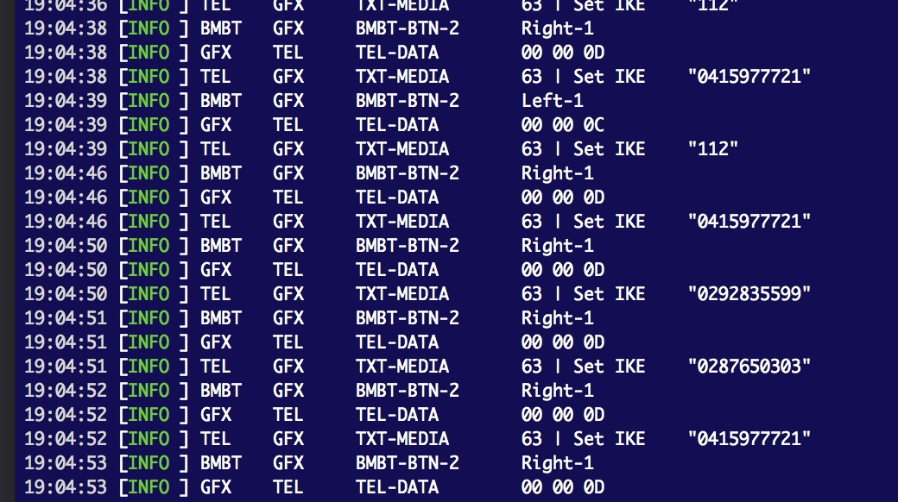

Walter
====

*
The receiver reads two bytes as the frame header (sender and length), then reading the frame tail. If the checksum does not match the frame check sequence, the receiver will byte shift, and continue doing so until the stream is synchronised.

I had considered using an inter packet gap to deliniate frames given the absence of any other flags. Sampling of the data had incredibly consisent timing, but I think this is partly a function of the bus running at a very low speed and otherwise not a particuarly robust solution when being so far away from the hardware, with many buffers separating you from the transmission medium.

As it happens, I rarely see the byte shifting in operation. Collisions between existing bus devices are rare, and I almost never see the stream opened mid-message, meaning I usually have synchronisation immediately. The other benefit of the byte shifting is I'm not dependent on timing, meaning I can pipe in stream that was previously logged which is very useful for debugging.

----

I've had success with building menus on the MK1 Video/GFX/TV module.

It's hard as the radio will only play the audio signal with a specific flag being set by the CD Changer. Unfortunatley it's this flag that causes the radio to immediately write to the display.

I'm testing all kinds of CD Changer status messages to prevent the radio from rendering any updates as I end up tussling with it as it tries to take over the screen. I've managed to limit the radio to writing only once with a combination of no magazine/loading bits. In this state, using the MFL or BMBMT track navigation causes no additional writes..
I've noticed that even devices like the Intravee seem to have ths fight, and with such a mature solution still having not totally solved it, I might assume this is as close as I'll get.

---

I've also managed to emulate most functions of the telephone, allowing use of the telephone via BMBT including, directories, info screen etc. The only thing I'm short of is the messages used to facilitate a call. In the absence of a network connection, I can attempt a call which of some help, but anything regarding inconing calls is nonbueono, and how the telephone interacts with the radio is non-beuno. The second E39 does have a much later Motorollo T interface, which, if those devices are still usable, I'll pick up.

---

A BMW I/K-BUS ~~interface~~ _tool thingy_ written in Ruby.

### Description

The project was started as a means add support for streaming music, and handsfree calls over Bluetooth. A RaspberryPi as a Bluetooth endpoint with support for the necessary Bluetooth profiles, with middleware to emulating IBUS music and telephony devices in the hope of having as native/smooth integration as possible.

Yes, you can retrofit OEM Bluetooth/AUX and so on, but for some reason I like the pain. Well, perhaps being indoctrinated into German electronics will make the drivetrain swap easier?

Made with a combination of enthusiasm and apparent self loathing in Melbourne, Australia.

### Features

I'm still in the throws of tinkering with the bus, and software currently reflects that and is more of a personal toolkit for said tinkering. However the objectives are:

- language agnostic bus interface ~~(i.e. JSON payloads via pipes/RabbitMQ etc)~~ _YAML over ZeroMQ_
- as many of the commands mapped as possible to facilitate a variety of integrations beyond my initial goal music/telephony, or simple observation of the bus, akin to [NavCoder](http://www.navcoder.com/).
- diagnostic (INPA) commands mapped to allow additional features like showing module coding data, vehicle control, or parking sensor data which is only available via diagnostics.
- comprehensive API to allow use of the mapped commands.
- high level API to abstract the occasionally obscure behaviour (I'm looking at _you_ IKE character display...)

### Progress

22 December 2018

- Streaming audio via Bluetooth has been implemented in semi-reasonable form. The heavy lifting is been done by Bluez which has support for the A2DP and AVRCP profiles out of the box via PulseAudio, and offers an API over the D-BUS. A second project- Wolfgang, makes the Bluez D-BUS API a little friendlier and emulates an car kit for the purposes of acting as broker for the vehicle.
- Wolfgang communicates with this library via ZeroMQ using a shared message standard.

17 October 2018

As mentioned above, it's current state is a reflection of my needs while I'm exploring the bus rather than being a useful library. Until the software is more.. definitive in it's functionality it can be found on [develop](https://github.com/piersholt/walter/tree/develop).

- the most common commands have be mapped, but I'm still figuring out a number of obscure flags in the bit arrays.
- I have captured most of the diagnostic commands that are relayed over the I/K BUS, but haven't mapped them as yet.
- there is a number of rudimentary APIs to allow writing a subset of commands to the bus. There is no hardware flow control or carrier sensing, merely collision detection and arbitrary retry attempts.
- bus data is logged to allow 'replaying' the traffic.

### Notes

- Developed using Rolf Resler's v6b USB [interface](http://www.reslers.de/IBUS/index.html). I
- While Rolf has implemented hardware flow control signals, the Silicon Labs CP2102 USB UART Bridge does not appear to support signals under OS X (or at least under 10.10.5, with SiLabs 4.x drivers). The signals appear a-okay under Windows.
- The vehicles used in development were a 1997 BMW E39 528i Touring, and 2001 BMW E39 540i, both with High IKE.
- The 528i (to which I have best access) has water damaged amplifier and nav. computer so related commands are a little vague/possibly utterly wrong.
- I'll fill in the gaps with the 540i when I can.

_P.S. Telephone numbers in screen shot aren't mine_ 😊
