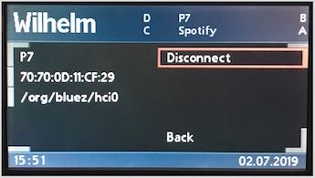
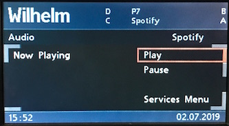
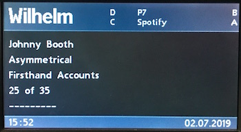

### `wilhelm-sdk`

a small MVC framework, and runtime environment for services, and built on top of `wilhelm-api`. The runtime environment includes a messaging queue (via `wilhelm-tools`), for inter-process or network communication with supporting services.

### Components

#### MVC Framework

Anyone familiar with MVC will recognise the general flow of the MVC components.

The controller acts as middleman between the application, and user. It listens to the view for user input events, and the model for data changes.

Example: Manager Service

- The user selects the preconfigured BMBT button for Bluetooth devices
- A request is routed to `ManagerController#index`
- `ManagerController` calls `#create`, which calls the `Manager` service for a list of devices
- `Manager` returns a instance of the `Devices` model
- `ManagerController` adds itself as observer to `Devices`.
- `ManagerController` then calls #index, which instantiates a new view `Manager::Index` with the model.
- `ManagerController` adds itself as observer to the view.
- `ManagerController` calls `#render`

#### User Interface

Not unlike other UI libraries, this is designed to allow for developing user interfaces quickly via a set of reusable classes that obfuscate the need for most of the underlying configuration.

There is a small set of base classes that all UI classes will descend from, but of most use will be the base views.

The two primary view base classes are:

**`UserInterface::View::BaseHeader`**

encapsulates the upper portion of the nav. radio mode, which has a fixed layout of approx. seven fields of varying sizes.

_image of header_

**`UserInterface::View::BaseMenu`**

encapsulates the lower, larger proportion of nav. radio mode, originally used digital radio station selection, manual presets, or CD changer selection.

_image of menus_

For anyone familiar with the various layouts used by the radio, there is unsurpringly, subclasses for the different layouts:

**`UserInterface::View::BasicMenu < BaseMenu`**

**`UserInterface::View::TitledMenu < BaseMenu`**

**`UserInterface::View::StaticMenu < BaseMenu`**

#### Controls

Each control can be listened to.
Each input can be configured as one of three different types of control
Any number of services can listen/subscribe to button events,
so to avoid having multiple services conflict, it's best to design a state to avoid this.

### Context

Is itself built with the SDK components, and provides the interface for child services to configure themselves.

Services first register themselves with `SevicesContext`:

    services_context.register_service(:manager, manager_object)

Once registered, child services will be notified of state changes in `ServicesContext`. The state changes are akin to a simple lifecycle callbacks.

The Manager service demonstrates use of the callbacks:

    # lib/wilhelm/services/manager/context.rb

    def state_change(new_state)
      case new_state

      # ServicesContext is online (UART interface available): enable service
      when Wilhelm::SDK::Context::ServicesContext::Online
        enable

      # ServicesContext is offline (Log file/debugging): disable service
      when Wilhelm::SDK::Context::ServicesContext::Offline
        disable

      # New UI Context: register Manager controllers
      when Wilhelm::SDK::UserInterface::Context
        new_state.register_service_controllers(
          bluetooth: UserInterface::Controller::ManagerController
        )

      # New Notifications Context: register Manager notification handlers
      when Wilhelm::SDK::Context::Notifications
        device_handler = Notifications::DeviceHandler.instance
        device_handler.manager = self
        new_state.register_handlers(device_handler)
      end
    end
